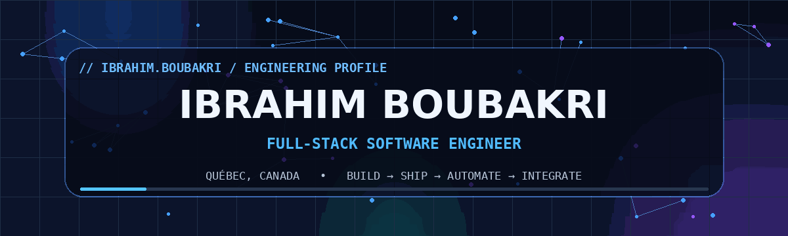
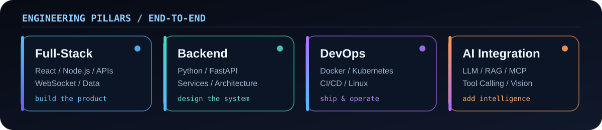
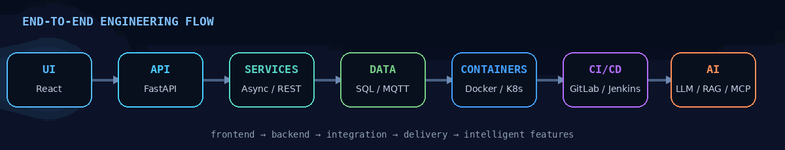
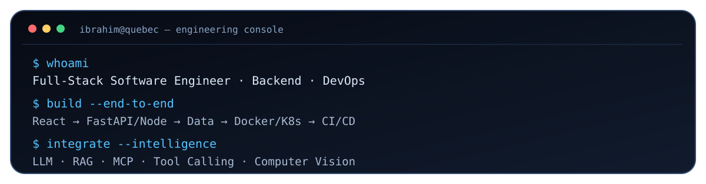

<div align="center">



<br/>

<a href="https://linkedin.com/in/ibrahimboubakri/"></a>
<a href="mailto:ibrahimboubakri1@gmail.com"></a>
<a href="https://github.com/boubakriibrahim"></a>


<br/><br/>

### Full-Stack Software Engineer · Backend · DevOps · AI Integration

I build software **end-to-end** — from web interfaces and backend services to containers, CI/CD, deployment, observability, and intelligent integrations.

</div>

---

## ⚡ Engineering, end to end



<br/>



<br/>



---

## 🧭 What I build

<table>
<tr>
<td width="50%" valign="top">

### 🌐 Full-Stack Applications
Modern web platforms connecting responsive interfaces with robust backend services, APIs, authentication, real-time communication, and data layers.

**Focus:** React · JavaScript/TypeScript · Node.js · REST APIs · WebSocket · SQL/NoSQL

</td>
<td width="50%" valign="top">

### ⚙️ Backend & Architecture
Modular backend systems designed around clear service boundaries, maintainability, integration, asynchronous workflows, validation, and operational reliability.

**Focus:** Python · FastAPI · Flask · API design · Microservices · Systems integration

</td>
</tr>
<tr>
<td width="50%" valign="top">

### 🚀 DevOps & Delivery
Reproducible environments and delivery pipelines that move software from commit to production with automation, testing, containerization, monitoring, and diagnostics.

**Focus:** Docker · Kubernetes · Linux · GitLab CI/CD · Jenkins · GitHub Actions

</td>
<td width="50%" valign="top">

### ✨ AI-Enabled Software
Modern AI capabilities integrated **inside real software systems** — not isolated demos — with workflow orchestration, response validation, and application-level tooling.

**Focus:** LLM integration · RAG · MCP · Tool/function calling · AI automation · PyTorch/OpenCV

</td>
</tr>
</table>

---

## 🧰 Core stack

<div align="center">

### Languages & Application Development


### Full-Stack & Backend


### DevOps & Infrastructure


### AI Integration & Intelligent Systems


</div>

---

## 🏗️ Selected engineering work

### 📦 [`PalletDataGenerator`](https://github.com/boubakriibrahim/PalletDataGenerator) — Open-source spotlight

A modular Python library for generating synthetic pallet and warehouse datasets with Blender for computer-vision workflows. It supports GPU-accelerated rendering, structured configuration, multiple annotation formats, testing, documentation, and containerized development.

`Python` · `Blender` · `Computer Vision` · `YOLO/COCO/VOC` · `GPU Rendering` · `Docker` · `Testing` · `CI/CD`

[](https://pypi.org/project/palletdatagenerator/)
[](https://github.com/boubakriibrahim/PalletDataGenerator)

<details>
<summary><b>See more engineering highlights</b></summary>
<br/>

### 🧩 Modular AI Integration & Automation Platform
Designed and contributed to modular backend services, REST APIs, workflow orchestration, metadata/execution tracking, automated testing, containerized delivery, and AI/LLM-enabled application workflows.

`Python` · `FastAPI` · `REST` · `Docker` · `SQL` · `GitLab CI/CD` · `LLM Integration` · `RAG` · `MCP` · `Tool Calling`

### 🤖 Industrial Perception & Robotics Platform
Built an end-to-end perception workflow spanning synthetic-data generation, model training, GPU inference, simulation, APIs, real-time communication, robotics integration, and edge deployment.

`PyTorch` · `YOLO-Pose` · `CUDA` · `Blender` · `PyBullet` · `ROS 2` · `FastAPI` · `WebSocket` · `React` · `NVIDIA Jetson`

### 📡 Real-Time Microservices Web Platform
Developed a microservices-based application for collecting, processing, storing, and visualizing technical data, including automated ETL pipelines over MQTT and containerized deployment workflows.

`React` · `Node.js` · `MongoDB` · `Python` · `MQTT` · `Docker` · `Kubernetes` · `Jenkins`

### 🛠️ DevOps & Validation Automation
Developed automation and validation tooling with structured logging, traceability, automated tests, CI/CD integration, containerized environments, and engineering documentation.

`Python` · `Docker` · `Jenkins` · `GitLab CI/CD` · `Linux` · `PowerShell` · `Automated Testing`

</details>

---

## 🧠 Engineering mindset

```text
I like systems where the path is visible:

idea
  └─► architecture
       └─► frontend + backend
            └─► APIs + data + integrations
                 └─► tests + containers
                      └─► CI/CD + deployment
                           └─► observability
                                └─► intelligent features where they actually help
```

> **Software first. Automation everywhere. AI where it creates real product value.**

---

## 📈 GitHub activity

<div align="center">


<br/><br/>

<!-- The workflow in .github/workflows/snake.yml generates these assets on the output branch. -->
<picture>
  <source media="(prefers-color-scheme: dark)" srcset="https://raw.githubusercontent.com/boubakriibrahim/boubakriibrahim/output/github-snake-dark.svg" />
  <source media="(prefers-color-scheme: light)" srcset="https://raw.githubusercontent.com/boubakriibrahim/boubakriibrahim/output/github-snake.svg" />
  
</picture>

</div>

---

## 🎯 Current direction

```yaml
location: "Québec, Canada"
primary_focus:
  - Full-Stack Software Engineering
  - Backend & Software Architecture
  - DevOps, CI/CD & Platform Delivery
secondary_edge:
  - AI / LLM Integration
  - Automation & Tool Calling
  - Computer Vision & Robotics
engineering_style:
  - modular
  - observable
  - reproducible
  - automation-first
  - production-minded
```

---

<div align="center">

## 🤝 Let's build something useful

If you're working on **full-stack platforms, backend systems, DevOps automation, developer tooling, or AI-enabled software**, I'd be happy to connect.

<a href="mailto:ibrahimboubakri1@gmail.com"></a>
<a href="https://linkedin.com/in/ibrahimboubakri/"></a>

<br/><br/>

<sub>Built around real engineering work: <b>full-stack → backend → DevOps → AI integration</b>.</sub>

</div>
