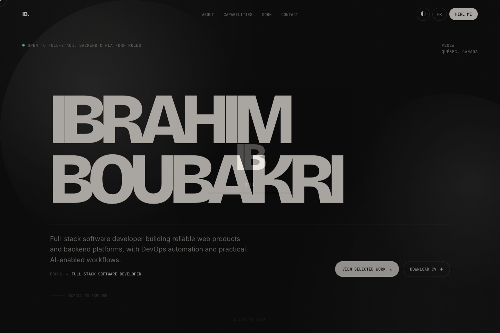

  

<h1 align="center" style="margin: 8px 0 4px 0; font-size: 28px;">Ibrahim Boubakri</h1>

  
  
  

  Building reliable, high-performance software across <b>backend</b>, <b>frontend</b>, <b>DevOps</b> and <b>AI integration</b> — from technical design through deployment and observability.

 

##  Featured Work

<table>
  <tr>
    <td align="center" width="50%">
      
    </td>
    <td align="center" width="50%">
      
    </td>
  </tr>
  <tr>
    <td align="center">
      <a href="https://boubakriibrahim.github.io"><b>Portfolio Website</b></a> 
      <small>Full-stack developer portfolio — React-style static site, i18n (EN/FR), project case studies</small>
    </td>
    <td align="center">
      <a href="https://github.com/boubakriibrahim/PalletDataGenerator"><b>Pallet Data Generator</b></a> 
      <small>Automated synthetic dataset generation for pallet detection using Blender &amp; PyTorch</small>
    </td>
  </tr>
</table>

 

##  Tech Stack

<table>
  <tr>
    <th align="left" width="50%">⚙️ Backend &amp; APIs</th>
    <th align="left" width="50%">🎨 Frontend</th>
  </tr>
  <tr>
    <td>Python · FastAPI · Flask · Node.js · REST APIs · WebSocket · SQL · MongoDB · MySQL</td>
    <td>React · JavaScript · TypeScript · Responsive UIs · Data Visualization</td>
  </tr>
  <tr>
    <th align="left">☁️ DevOps &amp; Delivery</th>
    <th align="left">🤖 AI &amp; Robotics</th>
  </tr>
  <tr>
    <td>Docker · Kubernetes · GitLab CI/CD · Jenkins · Linux · MQTT · Observability</td>
    <td>PyTorch · OpenCV · RAG · MCP · Agentic Workflows · ROS 2 · CUDA · YOLO-Pose</td>
  </tr>
</table>

 

##  Currently

- 🏢 **Modular AI Platform** — Full-Stack Developer (Architecture, DevOps &amp; AI Integration), Québec City / Remote
- 🎓 **M.Sc. Electrical Engineering** (Computer Engineering) — Université du Québec à Trois-Rivières, 2024 – 2026
- 🧩 Researching computer-vision perception pipelines: synthetic data → YOLO-Pose → ROS 2 / Jetson deployment

 

##  Find me elsewhere

<table>
  <tr>
    <td align="center"><a href="https://boubakriibrahim.github.io"><b>Portfolio</b></a></td>
    <td align="center"><a href="https://www.linkedin.com/in/ibrahimboubakri/"><b>LinkedIn</b></a></td>
    <td align="center"><a href="mailto:ibrahimboubakri1@gmail.com"><b>Email</b></a></td>
  </tr>
</table>

  🦸 Never stop dreaming, never stop trying and never stop learning.

